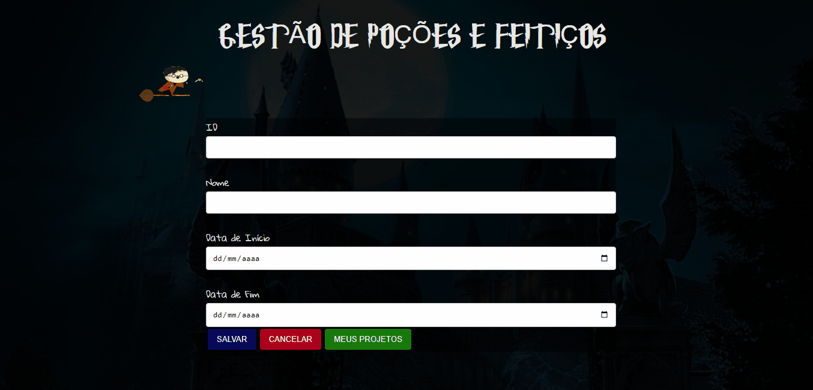

# ⚗️ GESTÃO DE POÇÕES E FEITIÇOS ⚗️

---

🚀 Esse Projeto faz parte do processo seletivo, desenvolvido para gerenciar tarefas e projetos🚀 

---
 

📌 
    <a href="#">PRÉ-REQUISITOS</a>
    <a href="#">FUNÇÕES</a>
    <a href="#">PROJETO</a>
    <a href="#">TECNOLOGIAS</a>
    <a href="#">AUTOR</a>📌 

 

---

### 📋  PRÉ REQUISITOS: 
   
Para rodar esse projeto na sua máquina basta apenas usar o <a href="https://code.visualstudio.com/">VSCode</a> ou algum editor
      de codigo da sua preferência

---

### ⚙️ Funções:

- [x] Criar Projeto
- [x] Deletar/Editar Projeto
- [x] Criar Atividade
- [x] Editar/Criar Atividade

---

---

### 🛠️ Ferramentas e Tecnologias:

As Ferramentas a seguir foram utilizadas na contrução do projeto:

- HTML5
- CSS3
- Javascript
- SPA
- LocalStorage
- API Fonts

---

✒️ Feito por: <a href="https://jeancorreaportfolio.com.br/">Jean Correa</a>. 
